# AWAS — Real-Time Operations Dashboard for Average-Speed Enforcement

### FIT3182 Big Data Management and Processing — Assignment 3

**Team:** 34328041 / 34423680
**Selected themes:** **(e)** interactive visualisation — a full-stack operations dashboard for traffic-speed enforcement (the main deliverable); supported by **(c)** a research-informed modification of the Spark stream-join that feeds it.

AWAS is an **admin operations console** for an average-speed enforcement network: a live React dashboard, backed by a FastAPI service, sitting on top of a Kafka → Spark Structured Streaming → MongoDB pipeline carried over and extended from Assignment 2. An operator uses it to watch each monitored lane in real time, manage the camera and vehicle registries, and investigate and export recorded violations.

This single README is both the **run book** (how to reproduce the system) and the **report** (what each part does, the design decisions, and the measured results).

### Project layout

```
34328041_34423680_assignment03/
├── README.md                 # this document — run book + report
├── slides.pdf                # presentation deck for the project
├── video.mp4                 # presentation video for the project
├── articles/                 # bundled reference papers
│   └── scale-join.pdf        #   ScaleJoin [7] — the core stream-join paper behind theme (c)
├── assets/                   # diagrams + dashboard screenshots used in this README
├── data/                     # bundled source data: vehicle.csv (car pool) + camera.csv
├── src/
│   ├── common/               # shared config, event schema, Mongo + Kafka helpers, logging
│   ├── seed_db.py            # seed 3 lanes, 3 cameras/lane, cars from vehicle.csv
│   ├── simulator/            # traffic generator (normal/speeder/sneaky): behaviors.py + run.py
│   ├── pipeline/             # Spark job: detect.py (self-join), sink.py (Mongo+Kafka),
│   │                         #            run.py (session+query), verify_detect.py (offline test)
│   └── backend/              # FastAPI: db, serialize, models, live (Kafka→WS), routers, main, run
├── frontend/                 # React + Vite operations dashboard (lib · components · pages)
├── deployment/
│   ├── config/docker-compose.yml   # zookeeper + kafka + mongo + spark on kafka-net
│   ├── Dockerfile                  # baked Spark image (fit3182/pyspark + A3 deps)
│   └── scripts/stack.sh            # single entry point: up/down/seed/topics/verify/joincmp/pipeline/sim
├── benchmarks/               # performance harness: run_benchmark.py, join_compare.py, latency_dist.py + results
└── requirements.txt          # Python deps (backend / simulator / pipeline / seeding)
```

> **Generative AI declaration.** We used Claude (Anthropic) as a support aid for coding sessions, documentation drafting, and debugging. We reviewed, tested, and verified all submitted work and remain accountable for its correctness.

---

## Contents

1. [Quick start](#1-quick-start)
2. [What the system does](#2-what-the-system-does)
3. [The operations dashboard (main deliverable)](#3-the-operations-dashboard-main-deliverable)
4. [Full-stack architecture](#4-full-stack-architecture)
5. [Backend API (serving the dashboard)](#5-backend-api-serving-the-dashboard)
6. [The streaming pipeline (detection engine)](#6-the-streaming-pipeline-detection-engine)
7. [Data model](#7-data-model)
8. [Running it — deployment and reproducibility](#8-running-it--deployment-and-reproducibility)
9. [Performance](#9-performance)
10. [Limitations and alternative designs](#10-limitations-and-alternative-designs)
11. [References](#references)

---

## 1. Quick start

The whole stack (Zookeeper + Kafka + MongoDB + Spark) is driven through one entry point, [`deployment/scripts/stack.sh`](deployment/scripts/stack.sh), which `docker exec`s into the right container for each command (so `kafka:9092` and `mongo` always resolve).

```bash
# 1. Bring up the stack (Zookeeper, Kafka, MongoDB, Spark) and seed reference data
deployment/scripts/stack.sh up
deployment/scripts/stack.sh seed                 # 3 lanes, 9 cameras, car pool (--cars-limit 500 for a fast demo)

# 2. Start the detection pipeline, then stream synthetic traffic into it
deployment/scripts/stack.sh pipeline             # (one terminal)
deployment/scripts/stack.sh sim --rate 3         # (another terminal)

# 3. Bring up the dashboard
cd src && python -m backend.run                  # FastAPI on :8000  (REST + live WebSockets)
cd frontend && npm install && npm run dev        # React/Vite on :5173
```

Then open **`http://localhost:5173`**. With traffic flowing you will see the lane view animate vehicles past the camera gantries, over-limit crossings glowing rose, and new violations appearing in the live feed as they are detected. `stack.sh down` removes everything; `stack.sh ps` shows status. Full command reference and configuration are in [§8](#8-running-it--deployment-and-reproducibility).

---

## 2. What the system does

Average-speed enforcement detects speeding by timing a vehicle between two cameras a known distance apart. It defeats the common evasion of braking only at the camera, because it measures the **mean** speed over the whole segment rather than the instantaneous speed at one point. Behind the dashboard, the pipeline runs two detectors per vehicle: an **instantaneous** check (one camera reading over its limit) and an **average** check (mean speed between two cameras over the limit) — the latter catches the "sneaky" driver who is never over the limit at any single camera ([§6](#6-the-streaming-pipeline-detection-engine)).

The point of Assignment 3 is that detection alone is not an operational system. Assignment 2 surfaced its results through a Jupyter notebook polling MongoDB every five seconds — fine for a demo, but not something a control room can run on. AWAS replaces that with a **real-time operations console**: a live per-lane view an operator actually watches, registries to manage the cameras and vehicles on the network, and a searchable, exportable record of every violation. The dashboard is the deliverable; the pipeline is the engine that feeds it.

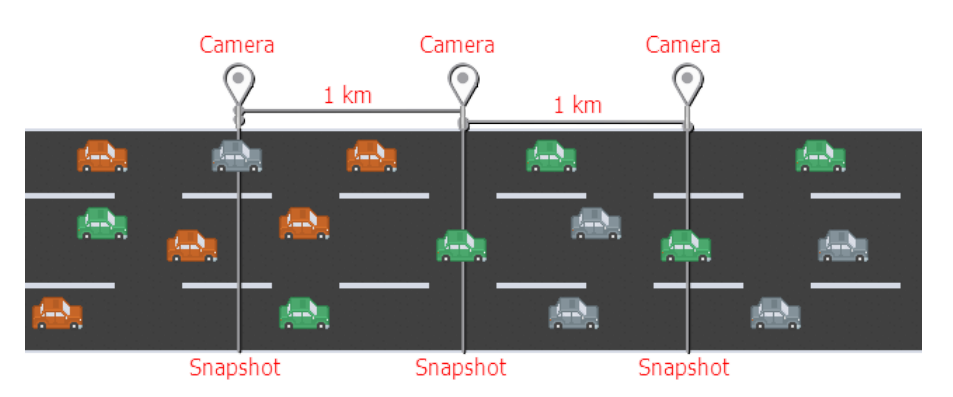

---

## 3. The operations dashboard (main deliverable)

A React + Vite single-page console ([`frontend/`](frontend/)) with five views, built for a traffic-enforcement operator. Every view renders fully from the REST API and **layers the live Kafka feeds on top**, so it is informative even before any traffic is streaming and updates in real time once it is. The visual language is a deliberate "control-room" design system — deep ink background, phosphor-teal for *live / under-limit*, amber for *instantaneous* violations, rose for *average* violations — so an operator reads state by colour at a glance.

### 3.1 Overview — network status board

The landing view (`/`) rolls the whole network up into a status board: four KPI cards (total violations, instantaneous, average, cameras online) and one interactive card per lane showing its camera count and a stacked bar splitting instantaneous vs average violations. Alongside sits a **network-wide live violation feed** — every newly detected violation across all lanes streams in via WebSocket, newest first, each row flashing as it arrives. Clicking a lane card drills into its live dashboard.

*Operator value:* one screen answers "is the network healthy, where are violations concentrated, and is anything happening right now."

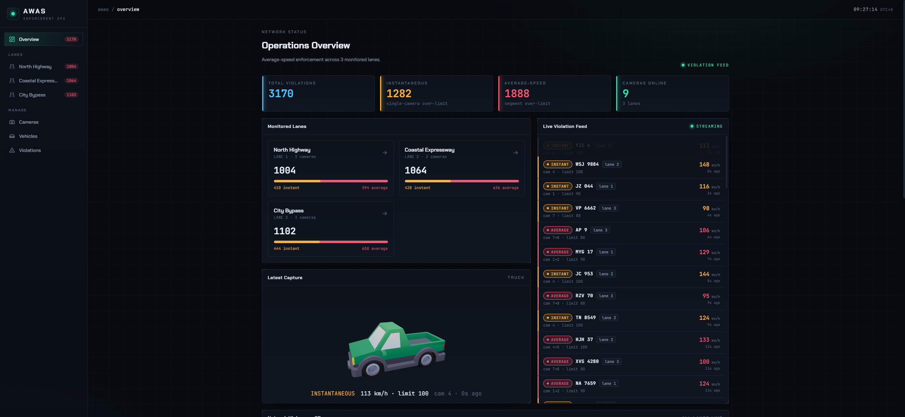

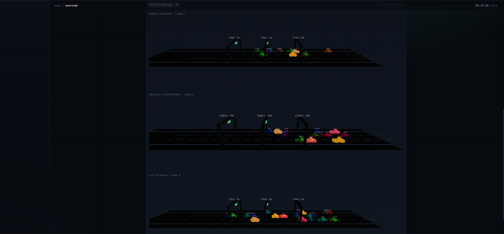

### 3.2 Live lane dashboard — the hero view

The lane view (`/lanes/{id}`) is the centrepiece: a hand-built animated schematic of one road segment. Camera **gantries** are drawn at their true kilometre positions; each **pulses green** as a vehicle crosses it. Vehicles appear as **moving dots** that glide between cameras — green under the limit, **rose with a pulsing ring when over** — labelled with plate and speed, fading out a few seconds after their last crossing. The animation is driven by the `/ws/lane/{id}` camera-event WebSocket, decoupled through a buffer and repainted on a 120 ms tick so it stays smooth regardless of message cadence. Beside the schematic are the lane's KPI cards, its ordered camera list, and a **lane-scoped live violation feed**.

*Operator value:* this is where evasion becomes visible. A "sneaky" driver shows as a dot that stays green at every gantry yet is flagged AVERAGE between them — the operator literally watches the behaviour the average-speed system exists to catch.

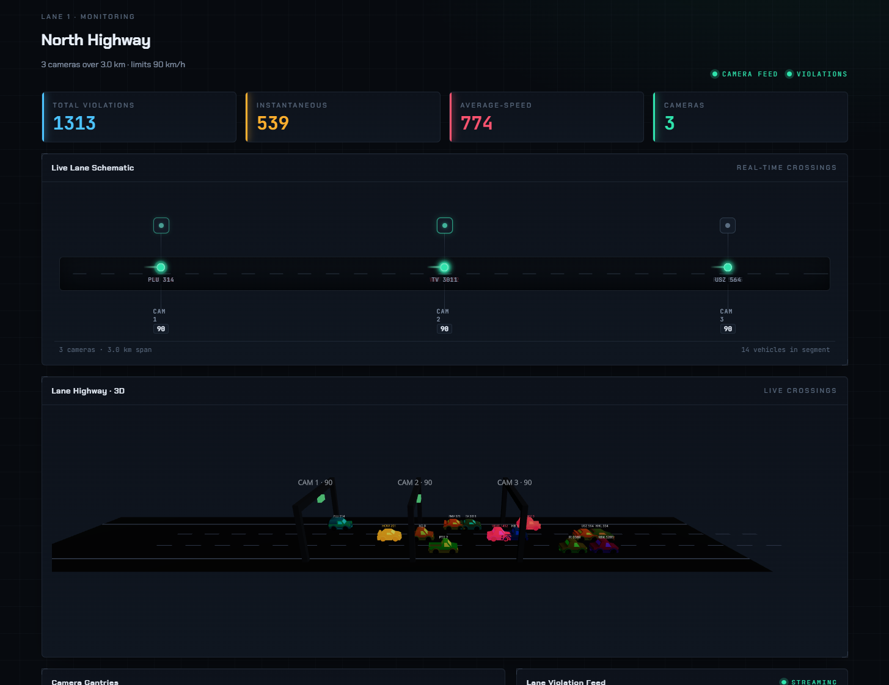

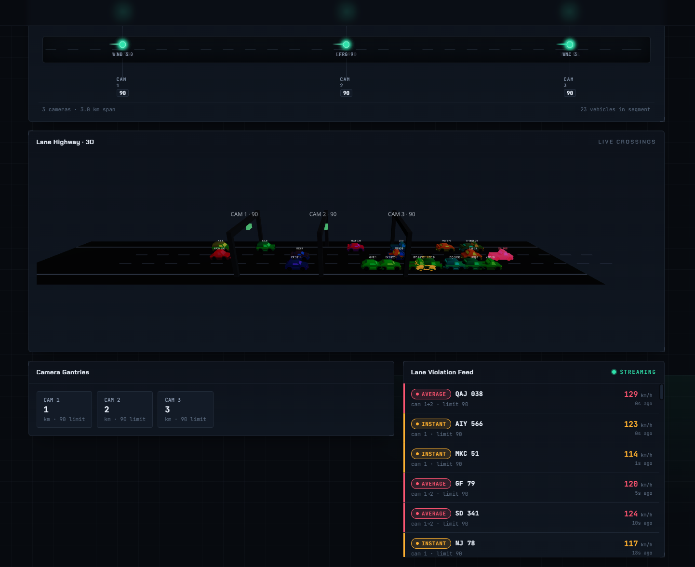

### 3.3 Camera management

The cameras view (`/cameras`) lists every camera grouped by lane, and lets an operator **append a new camera to a lane** from a small form (`POST /cameras`). The server assigns the next camera id and the position (last position + the configured spacing), so the operator only chooses the lane and an optional speed limit. Because events are enriched at the source and the simulator re-reads its camera config periodically, the new camera **goes live with no pipeline restart** — the form's confirmation says exactly that.

*Operator value:* the enforcement network can grow at runtime; extending a corridor is a form submission, not a redeploy.

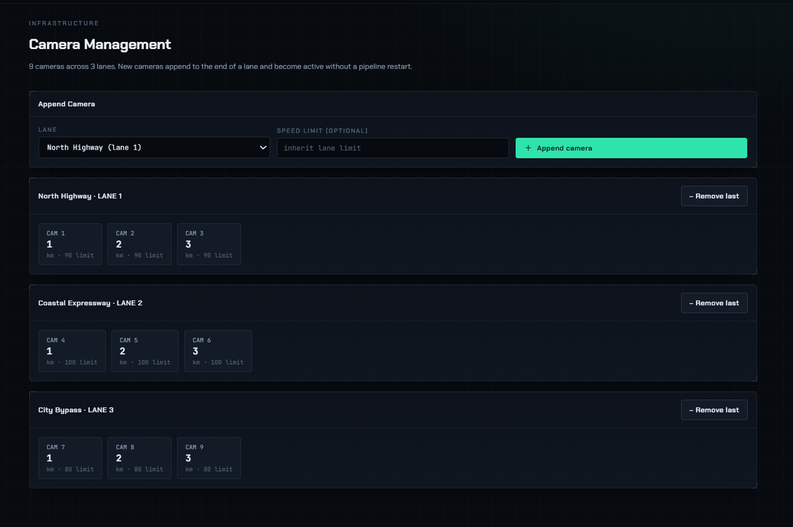

### 3.4 Vehicle registry

The vehicles view (`/cars`) is a searchable, paginated registry: type a plate prefix to filter, page through results, and **register a new vehicle** (plate, owner, address, type, registration date) via `POST /cars` (rejected with a clear message if the plate already exists). Selecting a vehicle opens a detail inspector showing its full record and its **complete violation history**.

*Operator value:* the per-vehicle investigation workflow — look up a plate, see who owns it and every time it has been flagged.

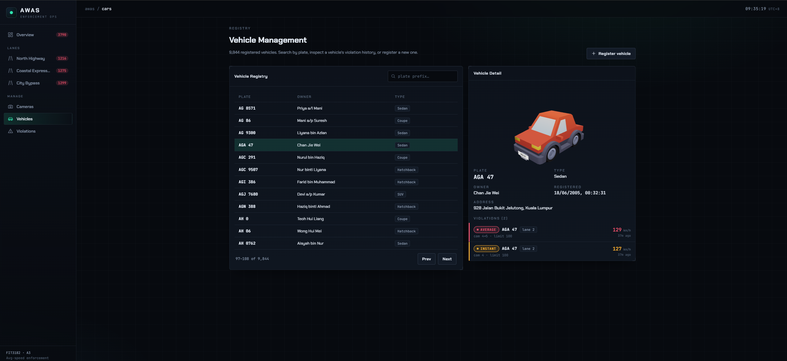

### 3.5 Violation tracking

The violations view (`/violations`) is the enforcement ledger: a filterable, paginated table of every recorded violation (detection time, type, plate, lane, camera segment, measured speed vs limit), filterable by lane, type, plate, and date in any combination. An **Export CSV** button downloads exactly the current filtered set — the link carries the active filters straight to `GET /violations/export.csv`, which streams the rows.

*Operator value:* the reporting and evidence workflow — slice the record any way needed and export it for downstream processing or prosecution.

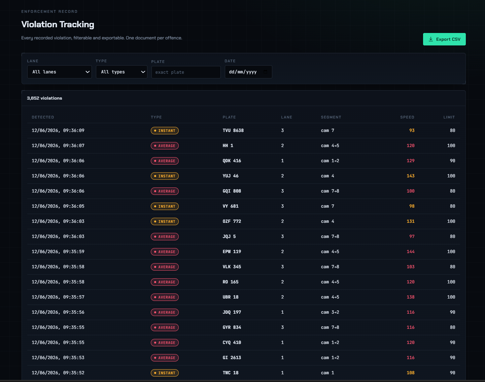

### 3.6 How it is built

- **React 18 + Vite SPA**, five routes via React Router; the Vite dev server proxies `/api` and `/ws` to the backend so there is no CORS setup in development.
- **Pure-CSS control-room design system** — no chart or animation libraries; the lane schematic, the pulsing gantries, the over-limit rings and the row-flash feed are all hand-built CSS + React state, which keeps the bundle small and the look bespoke.
- **Live data layer** — a small auto-reconnecting WebSocket hook (exponential backoff) plus a hybrid feed that seeds from REST and prepends live rows, de-duplicating on a natural violation key. Connection state is shown as a live/connecting/offline indicator on every feed.

---

## 4. Full-stack architecture

AWAS keeps the Assignment 2 substrate — Kafka [[1]](#ref-1) → Spark Structured Streaming [[2]](#ref-2), [[4]](#ref-4) → MongoDB — and wraps it in the dashboard, a backend, and a reproducible container stack.

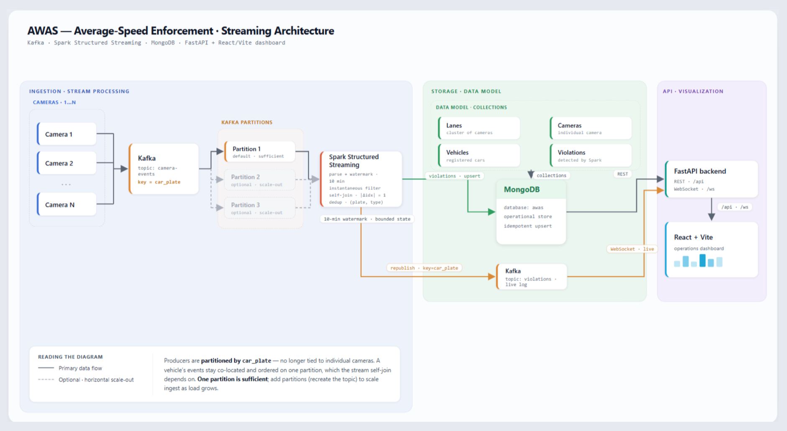

| Component | Module(s) | Responsibility |
|---|---|---|
| Simulator | [`src/simulator/`](src/simulator/) | Loads lanes/cameras/cars from Mongo and streams enriched `normal`/`speeder`/`sneaky` trips to the `camera-events` topic keyed by `car_plate`. Live / fast (load-test) / CSV-replay modes; re-reads camera config for runtime hot-add. |
| Streaming pipeline | [`src/pipeline/`](src/pipeline/) | One Spark job: parse + watermark, the two detectors, union + dedup, then `foreachBatch` → Mongo (idempotent) and a Kafka `violations` topic. |
| Backend | [`src/backend/`](src/backend/) (FastAPI) | REST over Mongo + two Kafka→WebSocket feeds; boots even when the broker is down. |
| Dashboard | [`frontend/`](frontend/) (React+Vite) | The five-view operations console of [§3](#3-the-operations-dashboard-main-deliverable). |
| Shared core | [`src/common/`](src/common/) | Env-overridable config, the one event schema, Kafka/Mongo factories, logging. |
| Deployment | [`deployment/`](deployment/) | `docker-compose` (zookeeper + kafka + mongo + spark on `kafka-net`) + the `stack.sh` entry point. |

**The live-data path.** As the pipeline writes each violation to MongoDB it also **republishes it to a Kafka `violations` topic**, and every camera crossing already flows through the `camera-events` topic. The backend's hub ([`src/backend/live.py`](src/backend/live.py)) consumes both topics and fans them out over WebSockets — `violations` drives the live feeds, `camera-events` drives the lane animation. Live updates ride a Kafka topic rather than MongoDB change streams because the unit's standalone `fit3182/mongo` image has no replica set, which change streams require.

---

## 5. Backend API (serving the dashboard)

A FastAPI service ([`src/backend/`](src/backend/)) exposing REST reads over Mongo and two live WebSocket feeds. It starts even if the broker is unreachable — REST stays usable and the feeds reconnect on their own. Interactive docs at `http://localhost:8000/docs`.

**REST** (the two `POST`s are the admin writes; everything else is read-only — violations are written by the pipeline, not the API):

| Method & path | Purpose |
|---|---|
| `GET /lanes` · `GET /lanes/{id}` | Lanes with camera counts + violation tallies; one lane with its ordered cameras. |
| `GET /cameras[?lane_id=]` | Cameras, all or one lane's, ordered along the road. |
| `POST /cameras` | **Hot-add** a camera to a lane — `camera_id`/`position_km` assigned server-side. Body: `{lane_id, speed_limit?}`. |
| `GET /cars[?plate=&skip=&limit=]` · `GET /cars/{plate}` | Paginated plate-prefix search; one car with its violation history. |
| `POST /cars` | Register a car (409 if the plate exists). |
| `GET /violations[?lane_id=&violation_type=&car_plate=&date=&skip=&limit=]` | Filtered, paginated violations (newest first) with a total. |
| `GET /violations/{id}` · `GET /violations/export.csv[?…filters]` | One violation by id; streamed CSV download of the filtered set. |
| `GET /health` | Liveness check. |

**WebSocket** (Kafka-fed, drive the live dashboard):

- `GET /ws/lane/{lane_id}` — every camera crossing on that lane (the lane animation).
- `GET /ws/violations` — each newly detected violation (the live feeds).

> The WebSocket feeds need a reachable broker. Because the stack's Kafka advertises `kafka:9092`, run the backend **inside `kafka-net`** (or make `kafka` resolvable on the host) for live delivery; REST works from anywhere the Mongo port is reachable.

---

## 6. The streaming pipeline (detection engine)

The pipeline is the engine behind the dashboard's data. It is carried over from Assignment 2 and re-architected around theme (c) — a single generalised stream-join in place of A2's hand-written per-pair joins. This section is intentionally compact; the full academic treatment is in [`A3_PROPOSAL.md`](A3_PROPOSAL.md).

### 6.1 The two detectors

One Spark job ([`src/pipeline/`](src/pipeline/)) reads the `camera-events` topic, applies an event-time **watermark**, and runs two detectors that emit the same row shape and are unioned:

- **Instantaneous** — a stateless filter: `speed_reading > speed_limit` at a single camera.
- **Average** — a stateful **self-join** that pairs a vehicle's crossings at adjacent cameras and flags the segment when mean speed exceeds the limit.

A worked example — vehicle `SNK 1`, three cameras 1 km apart, limit 90 km/h, braking *at* each camera but accelerating between them:

| camera | pos (km) | event_time | reading | | segment | Δt | dist | avg speed |
|---|---|---|---|---|---|---|---|---|
| 1 | 1.0 | 08:00:00 | 80 km/h | | 1→2 | 30 s | 1.0 km | **120 km/h** |
| 2 | 2.0 | 08:00:30 | 82 km/h | | 2→3 | 30 s | 1.0 km | **120 km/h** |
| 3 | 3.0 | 08:01:00 | 79 km/h | | | | | |

Every instantaneous reading is legal (≤ 90), so the instantaneous detector sees nothing — but both adjacent segments average 120 km/h, so the self-join flags an AVERAGE violation. Dedup collapses the two segment rows to one recorded violation per vehicle per detection window.

### 6.2 The generalised self-join

After events are keyed by `car_plate`, the self-join uses the one stream under two aliases — `a` (start crossing) and `b` (end crossing) — and pairs adjacent crossings of the same vehicle within a journey window ([`src/pipeline/detect.py`](src/pipeline/detect.py) `detect_average`):

```python
condition = expr(f"""
    a.car_plate  =  b.car_plate                          AND   -- same vehicle (the join key)
    a.lane_id    =  b.lane_id                            AND   -- same lane
    abs(b.camera_index - a.camera_index) = 1             AND   -- ADJACENT cameras only
    b.event_time >  a.event_time                         AND   -- b is the later crossing
    b.event_time <= a.event_time + interval {config.JOIN_WINDOW}  -- journey window
""")
# avg_speed = |b.position_km - a.position_km| * 3600 / Δt seconds ;  violation iff avg_speed > b.speed_limit
```

A single operator subsumes every adjacent camera pair, in both travel directions, for any number of cameras and lanes — replacing A2's six hand-written joins. **State is bounded**: the journey window plus the event-time watermark [[4]](#ref-4), [[5]](#ref-5) let Spark evict a crossing once it can gain no new partner, so join state stays at roughly `arrival_rate × (window + watermark)` regardless of how long the stream runs.

### 6.3 The consecutive-segment refinement

A2 joined *all* camera pairs. AWAS restricts the join to **adjacent** cameras (`|Δindex| = 1`), which is both the natural definition of point-to-point enforcement [[9]](#ref-9) and a real efficiency gain. A vehicle passing `k` cameras need only be checked on its `k−1` consecutive segments rather than all `k(k−1)/2` pairs — a non-adjacent pair such as `(cam1, cam3)` adds no enforcement power, since if a driver speeds across it the adjacent segments already exceed the limit. Per vehicle this drops join output from `O(k²)` to `O(k)`, the quantity the parallel-stream-join literature counts as join cost [[8]](#ref-8) (the comparison space that handshake join [[6]](#ref-6) and ScaleJoin [[7]](#ref-7) exist to distribute).

Both predicates are implemented behind a `JOIN_STRATEGY` switch (`adjacent`, default; `all-pairs`, the A2 baseline). [`pipeline/verify_detect.py`](src/pipeline/verify_detect.py) asserts the two flag *identical* final violations, and the cost difference is measured head-to-head in [§9](#9-performance). The one case the adjacent form forgoes is a *missed* camera reading (a `cam1 → cam3` crossing with no `cam2` event); that bound and the more advanced designs that remove it are in [§10](#10-limitations-and-alternative-designs).

### 6.4 From A2 to A3: the four improvements

| A2 limitation | A3 fix |
|---|---|
| Parallelism welded to the **number of cameras** (one topic per camera). | **One topic `camera-events` keyed on `car_plate`** — parallelism becomes a partition-count knob ([§6.5](#65-kafka-partitioning)); a high-cardinality key spreads load and keeps each vehicle's events ordered on one partition. |
| Join topology grows **quadratically**, needs a rewrite to add a camera. | **One generalised self-join** ([§6.2](#62-the-generalised-self-join)) for any number of cameras/lanes, with the `O(k²) → O(k)` refinement. |
| Camera config baked into the Spark job. | **Source-side enriched events** carry `lane_id`, `camera_index`, `position_km`, `speed_limit`, so cameras can be **hot-added at runtime** with no restart (the dashboard's [§3.3](#33-camera-management)). |
| **Non-idempotent** persistence — a `$push` array per `(plate, date)` that re-runs duplicate. | **One idempotent document per violation**, upserted on `(car_plate, window_start)`, which also makes the dashboard's filtering, paging and CSV export trivial ([§7](#7-data-model)). |

### 6.5 Kafka partitioning

A record's partition is `hash(key) mod #partitions` [[1]](#ref-1), so keying on `car_plate` keeps all of a vehicle's events on one partition, in order — the property the join depends on. `car_plate` is chosen over `camera_id` because it is high-cardinality with near-uniform load, where `camera_id` (cardinality 3, uneven traffic) would hot-spot one partition and reproduce the A2 ceiling.

The system is correct on a single partition (the default the old `fit3182/kafka` 0.10.x broker auto-creates). `KAFKA_TOPIC_PARTITIONS` is the opt-in scalability knob; because that broker predates the `CreateTopics` API it must be set with the broker CLI on a fresh topic, via `stack.sh topics`. Partitions cannot be grown in place without scattering a vehicle's events across partitions, so re-partitioning is a deliberate `down`/`up` admin action, not a silent startup side-effect.

---

## 7. Data model

MongoDB database `awas` ([`src/common/mongo.py`](src/common/mongo.py)):

| Collection | Document | Key indexes |
|---|---|---|
| `lanes` | `{ lane_id, name }` | `lane_id` (unique) |
| `cameras` | `{ camera_id, lane_id, position_km, speed_limit }` | `camera_id` (unique); `(lane_id, position_km)` |
| `cars` | `{ car_plate, owner_name, owner_addr, vehicle_type, registration_date }` | `car_plate` (unique) |
| `violations` | one document per violation (below) | `car_plate`, `lane_id`, `date`; **`uniq_violation`** (unique) |

The **enriched Kafka event** ([`src/common/schema.py`](src/common/schema.py)), keyed by `car_plate`: `event_id, car_plate, lane_id, camera_id, camera_index, position_km, speed_limit, timestamp, speed_reading`. The bolded-in-A3 fields (`lane_id`, `camera_index`, `position_km`, `speed_limit`) are the source-side enrichment that lets Spark compute segments without a config lookup.

The **violation document** ([`src/pipeline/sink.py`](src/pipeline/sink.py)): `car_plate, lane_id, violation_type ∈ {INSTANTANEOUS, AVERAGE}, camera_id_start/end, position_start/end_km, timestamp_start/end, speed_limit, speed_reading` (null for AVERAGE), `avg_speed` (null for INSTANTANEOUS), `window_start, date, detected_at`. The unique index and the sink's upsert key are the same pair — `(car_plate, window_start)` — so a replayed micro-batch upserts instead of duplicating: **one document per vehicle per detection window**, idempotent across restarts.

---

## 8. Running it — deployment and reproducibility

The whole stack is one `docker-compose` file ([`deployment/config/docker-compose.yml`](deployment/config/docker-compose.yml)) — `zookeeper`, `kafka`, `mongo`, and a built `spark` image ([`deployment/Dockerfile`](deployment/Dockerfile) = `fit3182/pyspark` + [`requirements.txt`](requirements.txt)) — all on the `kafka-net` network, with the project bind-mounted into the Spark container and the Ivy cache persisted so the Kafka connector jar downloads once.

**`stack.sh` command reference** — each command `docker exec`s into the right container, so nothing needs host-side Java or hostname setup:

```bash
deployment/scripts/stack.sh up        # build + start all four containers on kafka-net
deployment/scripts/stack.sh seed      # seed 3 lanes / 9 cameras / car pool into Mongo
deployment/scripts/stack.sh topics    # (optional) set parallel partitions on a fresh topic
deployment/scripts/stack.sh verify    # OFFLINE join test, both strategies — asserts the detectors, no broker
deployment/scripts/stack.sh joincmp   # OFFLINE adjacent-vs-all-pairs join-cost sweep — no broker
deployment/scripts/stack.sh pipeline  # run the Spark streaming query (--reset; honours JOIN_STRATEGY)
deployment/scripts/stack.sh sim ...   # stream synthetic traffic into the stack (flags below)
deployment/scripts/stack.sh down      # stop + remove everything    (ps = status)
```

**Simulator** — streams enriched `normal`/`speeder`/`sneaky` trips to `camera-events`:

```bash
deployment/scripts/stack.sh sim                                      # live, default mix (70/20/10), 0.5 trips/s
deployment/scripts/stack.sh sim --rate 2 --total 200                 # 2 trips/s, stop after 200 trips
deployment/scripts/stack.sh sim --normal 0.5 --speeder 0.3 --sneaky 0.2  # custom behaviour mix
deployment/scripts/stack.sh sim --fast --total 100000                # load test: emit as fast as possible
deployment/scripts/stack.sh sim --source csv --scale 5               # replay the A2 camera_event_*.csv files
deployment/scripts/stack.sh sim --source csv --data-dir /path/to/csv # …from a custom folder
```

> The default synthetic mode needs only the bundled `data/vehicle.csv`. The optional `--source csv` replay mode reads the large A2 `camera_event_A/B/C.csv` files, which are **not bundled** (≈140 MB); place them in the project's `data/` folder or point `--data-dir` at a folder that has them.

> Run the simulator **inside the stack** (as `stack.sh sim` does): a host shell can't resolve the `kafka` hostname the broker advertises, so a host-run producer connects but its events never arrive. To run on the host, make `kafka`/`mongo` resolvable or override `KAFKA_BOOTSTRAP_SERVERS`/`MONGO_HOST`.

**Dashboard** — `cd src && python -m backend.run` (FastAPI on `:8000`), then `cd frontend && npm install && npm run dev` (Vite on `:5173`; `npm run build` emits a static `dist/`). A typical bring-up is four terminals: the stack, the pipeline, the simulator, and the dashboard, with the backend on the host.

**Configuration** — every setting is env-overridable from [`src/common/config.py`](src/common/config.py), so the same code runs inside the network or from the host:

| Variable | Default | Meaning |
|---|---|---|
| `KAFKA_BOOTSTRAP_SERVERS` | `kafka:9092` | broker address (`localhost:9092` from host) |
| `KAFKA_TOPIC` / `KAFKA_VIOLATIONS_TOPIC` | `camera-events` / `violations` | event topic; live-violation republish topic |
| `KAFKA_TOPIC_PARTITIONS` | `6` | parallelism knob ([§6.5](#65-kafka-partitioning)); applies on a fresh topic only |
| `MONGO_HOST` / `MONGO_PORT` / `MONGO_DB` | `localhost` / `27017` / `awas` | operational store |
| `WATERMARK_DURATION` / `JOIN_WINDOW` | `10 minutes` | event-time watermark; journey window |
| `JOIN_STRATEGY` | `adjacent` | `adjacent` (O(k), default) or `all-pairs` (A2 baseline) |
| `DEDUP_WINDOW` / `CAMERA_SPACING_KM` | — | idempotency-key floor; spacing for a hot-added camera |
| `SPARK_SHUFFLE_PARTITIONS` | `4` | Spark shuffle parallelism |
| `BACKEND_HOST` / `BACKEND_PORT` / `CORS_ORIGINS` | `0.0.0.0` / `8000` / — | FastAPI binding |

---

## 9. Performance

Per the spec, performance evidence is **generated by running the code**, not pasted as static output. The harness in [`benchmarks/`](benchmarks/) produces the numbers on the Docker stack (we do not run Spark/Kafka in the authoring environment); see [`benchmarks/README.md`](benchmarks/README.md). The analytical claim is that A3 turns A2's **structural** ceiling (parallelism welded to 3 cameras) into a **tunable** one (partition count), and a quadratic, recompilation-bound join topology into a single operator with linear per-vehicle output.

**Experiment 1 — the join-strategy comparison** (`stack.sh joincmp`; 200 vehicles per setting, each crossing all `k` cameras). The `adjacent` refinement emits `k−1` join rows per vehicle, the `all-pairs` A2 baseline emits `k(k−1)/2`:

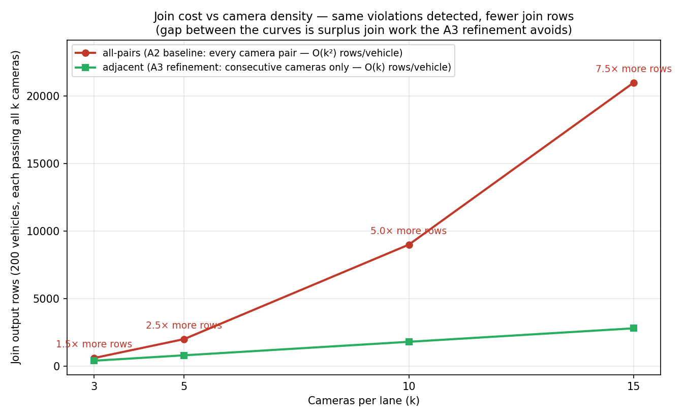

| `k` (cameras/lane) | `adjacent` rows — A3, `O(k)` | `all-pairs` rows — A2, `O(k²)` | baseline overhead |
|---|---|---|---|
| 3 | 400 | 600 | 1.5× |
| 5 | 800 | 2,000 | 2.5× |
| 10 | 1,800 | 9,000 | 5.0× |
| 15 | 2,800 | **21,000** | **7.5×** |

Both strategies detect the exact same violations (asserted by `verify_detect.py`), so every extra `all-pairs` row is surplus join work with zero enforcement value, and the gap widens as cameras densify — `k/2`, i.e. 7.5× at a realistic 15-site corridor. Wall time does not separate the strategies at this scale (~0.2–0.5 s; dominated by Spark's fixed per-query overhead), so the row count is reported as the cost metric — it is what becomes real shuffle, state and downstream load at production arrival rates. Full rows in [`benchmarks/join_compare.csv`](benchmarks/join_compare.csv).

**Experiment 2 — single-host capacity and the partition curve** (one fresh stack per setting, 60,000 events per run, `SPARK_SHUFFLE_PARTITIONS = 4`, warmup-gated):

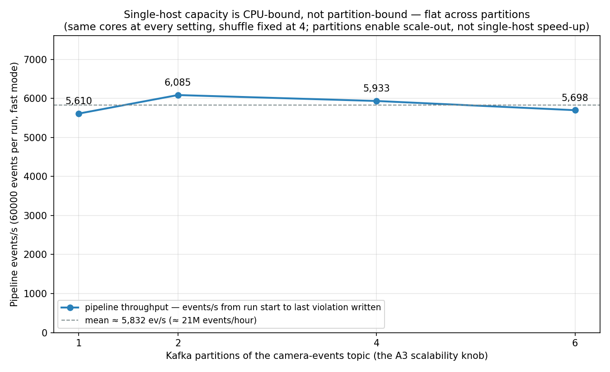

| Kafka partitions | pipeline ev/s | drain (s) | violations found |
|---|---|---|---|
| 1 | 5,610 | 10.69 | 4,690 |
| 2 | 6,085 | 9.86 | 4,704 |
| 4 | 5,933 | 10.11 | 4,779 |
| 6 | 5,698 | 10.53 | 4,737 |

The single host sustains **≈ 5,900 ev/s (~21 M crossings/hour)** while detecting ~4,700 violations per run — a measured capacity-planning baseline. The curve is **flat** across 1 → 6 partitions (8.5% spread, inside the noise band), which is the *correct* result: a partition is the unit of *consumer* parallelism, not added compute, and on one host every consumer shares the same `local[*]` cores, so the pipeline is CPU-bound, not partition-bound. The sweep nonetheless validates the structural claim — four topologies from one environment variable and zero code changes, something A2 could not express at all. Realising the speed-up needs a partition per machine (the multi-node deployment of [§10](#10-limitations-and-alternative-designs)). Full rows in [`benchmarks/results.csv`](benchmarks/results.csv).

**Experiment 3 — end-to-end detection latency** (live-rate streaming, `sim --rate 3`, `adjacent` strategy). Latency is `detected_at − timestamp_end`: the wall-clock time from a vehicle completing a segment (its end-camera crossing) to the violation being persisted and pushed to the dashboard's live feed. It is measured under *live-rate* streaming because the Experiment 2 fast-mode runs carry synthetic event times (flagged `latency_reliable = no`); here [`benchmarks/latency_dist.py`](benchmarks/latency_dist.py) reads every per-violation latency straight from MongoDB over `n = 167` violations.

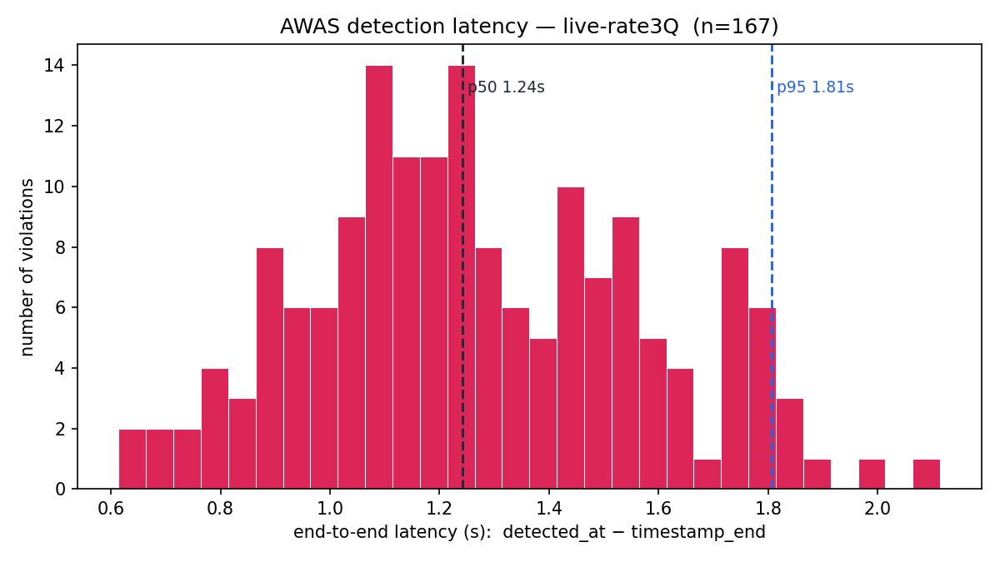

| min | p50 (median) | mean | p95 | p99 | max |
|---|---|---|---|---|---|
| 0.61 s | 1.24 s | 1.27 s | 1.81 s | 1.91 s | 2.11 s |

The distribution is **tight and single-moded** (stdev ≈ 0.31 s): every one of the 167 violations surfaced within **2.2 s** of the car completing the segment, with the median at **1.24 s**. This is micro-batch latency — the Spark trigger interval plus the window/watermark mechanics, not the join algorithm — and it sets the operational envelope: a violation appears on the operator's live feed a second or two after it physically happens, which is well inside "real-time operations" needs but not hard-real-time control ([§10](#10-limitations-and-alternative-designs)). Raw values in [`benchmarks/latency_live-rate3Q.csv`](benchmarks/latency_live-rate3Q.csv).

---

## 10. Limitations and alternative designs

### 10.1 Known limitations

- **Single-node demonstration.** Evaluation runs on one host (`local[*]`); throughput is CPU-bound at ≈5,900 ev/s regardless of partition count (§9). The partition knob is demonstrated as *operable*; its speed-up is realised only on a multi-node cluster.
- **Micro-batch latency.** Structured Streaming's micro-batch model adds seconds-scale latency [[3]](#ref-3) — measured at a 1.24 s median / 2.11 s max end-to-end (§9, Experiment 3) — fine for enforcement review and a live operations feed, not for hard real-time control.
- **Missed-camera gap.** The adjacent-only join ([§6.3](#63-the-consecutive-segment-refinement)) does not bridge a skipped camera (a `cam1 → cam3` crossing with no `cam2` reading).
- **Key skew.** Partitioning on `car_plate` trades A2's structural camera-skew for a rare per-plate skew; the remedy if it ever materialised is ScaleJoin's [[7]](#ref-7) key-free round-robin distribution.
- **Old-broker constraints.** The 0.10.x image forces the CLI partition path and rules out MongoDB change streams (standalone image), which is why live updates ride a Kafka `violations` topic.

### 10.2 Alternative join designs not implemented

The detector is a standard Spark stream–stream equi-join with a range predicate (an *interval join*). The contribution is the `O(k²) → O(k)` candidate-space reduction ([§6.3](#63-the-consecutive-segment-refinement)) and the partition-key choice, not a new join engine. The interval join was chosen because it is the standard mechanism on the unit's Spark 3.3 runtime and suffices for a key-partitionable predicate; it is not the most capable design in the literature. Four more advanced approaches were considered but not implemented, each a potentially stronger basis for the algorithm:

- **Arbitrary keyed-state processing** (Spark 3.4 `applyInPandasWithState` [[10]](#ref-10), or Flink `KeyedProcessFunction`) — retains only each vehicle's last crossing per lane as keyed state, giving `O(active vehicles)` state and closing the missed-camera gap. Not implemented because the unit runtime is Spark 3.3, where PySpark exposes no arbitrary-stateful operator. This is the most direct next step.
- **Complex Event Processing / row-pattern matching** (Flink CEP, SQL `MATCH_RECOGNIZE`, on the SASE model [[11]](#ref-11)) — expresses the detection as a sequence pattern directly, with no self-join. Not implemented because Spark Structured Streaming has no CEP operator.
- **A record-at-a-time engine** (Apache Flink [[12]](#ref-12)) — sub-second latency, native interval joins, and a RocksDB state backend for state larger than memory. Not adopted because A2 established the Spark stack and the comparison against it is required.
- **Skew-resilient parallel join algorithms** (handshake join [[6]](#ref-6), ScaleJoin [[7]](#ref-7), join-matrix schemes such as BiStream [[13]](#ref-13)) — distribute the comparison workload independently of any partition key. Not implemented because the predicate was deliberately engineered to be key-partitionable, so a standard join suffices under the expected workload; under pronounced skew or a general theta predicate one of these would be the better choice.

The `O(k²) → O(k)` reduction is engine-independent and would carry over to any of these; the keyed-state operator and a CEP formulation are the principal directions for a more capable future version.

---

## References

<a id="ref-1"></a>[1] J. Kreps, N. Narkhede, and J. Rao, "Kafka: a Distributed Messaging System for Log Processing," in *Proc. NetDB*, 2011. [[PDF]](https://notes.stephenholiday.com/Kafka.pdf)

<a id="ref-2"></a>[2] M. Zaharia et al., "Resilient Distributed Datasets: A Fault-Tolerant Abstraction for In-Memory Cluster Computing," in *Proc. USENIX NSDI*, 2012. [[link]](https://www.usenix.org/conference/nsdi12/technical-sessions/presentation/zaharia)

<a id="ref-3"></a>[3] M. Zaharia, T. Das, H. Li, T. Hunter, S. Shenker, and I. Stoica, "Discretized Streams: Fault-Tolerant Streaming Computation at Scale," in *Proc. ACM SOSP*, 2013. [[doi]](https://doi.org/10.1145/2517349.2522737)

<a id="ref-4"></a>[4] M. Armbrust et al., "Structured Streaming: A Declarative API for Real-Time Applications in Apache Spark," in *Proc. ACM SIGMOD*, 2018. [[doi]](https://doi.org/10.1145/3183713.3190664)

<a id="ref-5"></a>[5] T. Akidau et al., "The Dataflow Model: A Practical Approach to Balancing Correctness, Latency, and Cost in Massive-Scale, Unbounded, Out-of-Order Data Processing," in *Proc. VLDB Endowment*, vol. 8, no. 12, 2015. [[doi]](https://doi.org/10.14778/2824032.2824076)

<a id="ref-6"></a>[6] J. Teubner and R. Mueller, "How Soccer Players Would Do Stream Joins," in *Proc. ACM SIGMOD*, 2011. [[doi]](https://doi.org/10.1145/1989323.1989389)

<a id="ref-7"></a>[7] V. Gulisano, Y. Nikolakopoulos, M. Papatriantafilou, and P. Tsigas, "ScaleJoin: A Deterministic, Disjoint-Parallel and Skew-Resilient Stream Join," *IEEE Transactions on Big Data*, 2016. [[doi]](https://doi.org/10.1109/TBDATA.2016.2624274) · [[bundled PDF]](articles/scale-join.pdf)

<a id="ref-8"></a>[8] J. Kang, J. F. Naughton, and S. D. Viglas, "Evaluating Window Joins over Unbounded Streams," in *Proc. IEEE ICDE*, 2003. [[doi]](https://doi.org/10.1109/ICDE.2003.1260804)

<a id="ref-9"></a>[9] D. W. Soole, B. C. Watson, and J. J. Fleiter, "Effects of Average Speed Enforcement on Speed Compliance and Crashes: A Review of the Literature," *Accident Analysis & Prevention*, vol. 54, 2013. [[doi]](https://doi.org/10.1016/j.aap.2013.01.018)

<a id="ref-10"></a>[10] Apache Spark, "SPARK-40434: Implement `applyInPandasWithState` in PySpark" (arbitrary stateful processing), Apache Software Foundation, 2022. [[issue]](https://issues.apache.org/jira/browse/SPARK-40434)

<a id="ref-11"></a>[11] J. Agrawal, Y. Diao, D. Gyllstrom, and N. Immerman, "Efficient Pattern Matching over Event Streams," in *Proc. ACM SIGMOD*, 2008. [[doi]](https://doi.org/10.1145/1376616.1376634)

<a id="ref-12"></a>[12] P. Carbone, A. Katsifodimos, S. Ewen, V. Markl, S. Haridi, and K. Tzoumas, "Apache Flink: Stream and Batch Processing in a Single Engine," *IEEE Data Engineering Bulletin*, vol. 38, no. 4, 2015. [[PDF]](http://sites.computer.org/debull/A15dec/p28.pdf)

<a id="ref-13"></a>[13] Q. Lin, B. C. Ooi, Z. Wang, and C. Yu, "Scalable Distributed Stream Join Processing," in *Proc. ACM SIGMOD*, 2015. [[doi]](https://doi.org/10.1145/2723372.2746485)
